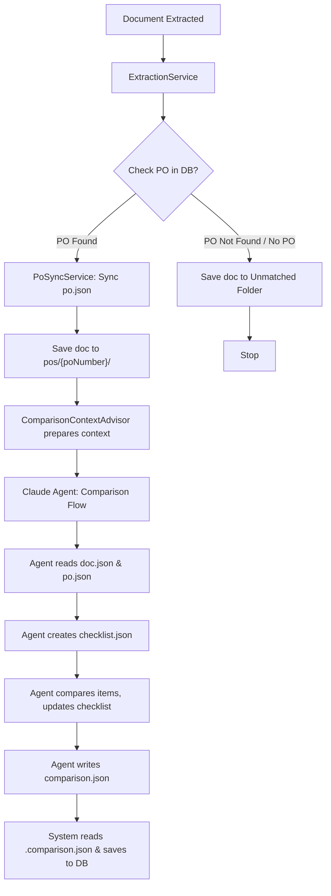

# Filesystem-based Dynamic Context Discovery for AI Matching

## Overview
This document outlines the architecture for a filesystem-based context discovery mechanism for AI line item matching. This approach replaces the vector-store-based RAG with a structured directory of JSON files that the Claude AI agent can explore using native filesystem access.

## Directory Structure
The virtual filesystem (VFS) is organized by company and document state:

- **Linked Documents**: `/app/data/storage/companies/{companyId}/pos/{poNumber}/{type}/{id}.json`
- **Unmatched Documents**: `/app/data/storage/companies/{companyId}/unmatched/{type}/{id}.json`
- **PO Master Files**: `/app/data/storage/companies/{companyId}/pos/{poNumber}/po.json`
- **Checklist Files**: `{id}.checklist.json` - tracks comparison progress
- **Supporting Files**: `{id}.audit.jsonl` and `{id}.comparison.json` are stored in the same directory as `{id}.json`.

Supported types include `invoices`, `delivery_slips`, and `delivery_notes`.

## Key Components

### 1. Claude Agent Model (`AgentModelConfig`)
Configures the Claude agent for autonomous filesystem-based comparison:
- **Model**: `claude-opus-5-20250514` (configurable via properties)
- **Sandbox**: `LocalSandbox` restricts agent to VFS root directory
- **YOLO Mode**: Enables autonomous execution without confirmation prompts
- **Native File Access**: Claude agent reads/writes files directly, no custom tools needed

### 2. Virtual Filesystem Service (`VirtualFilesystemService`)
Manages the physical storage of JSON files on the server's filesystem.
- Handles directory creation and document saving
- Provides abstraction for path construction based on `companyId`, `poNumber`, and `documentType`
- Manages checklist files for progress tracking

### 3. Just-in-Time PO Synchronization (`PoSyncService`)
Ensures that the VFS has the latest PO data before an AI comparison starts.
- **Trigger**: Called when a document is matched to a PO in the database.
- **Action**: Fetches PO and line items from the database and writes `po.json`.
- **Linking Metadata**: The `po.json` includes the original database index for each line item, allowing the AI to map matches back to the database precisely.

### 4. Comparison Context Advisor (`ComparisonContextAdvisor`)
Prepares the context for the Claude agent before execution:
- Syncs PO data to VFS via `PoSyncService`
- Saves document extraction to VFS
- Sets working directory to company folder for isolation
- Provides relative file paths for agent to use

### 5. Agent Audit & Comparison Results
Captures the agent's internal logic and results for training and audit purposes:
- **Audit Logging**: `AgentAuditAdvisor` (stateless, reads context from `ChatClientRequest`) intercepts interactions and streams structured logs (JSONL) to `{id}.audit.jsonl`.
- **Comparison Results**: The agent writes its final matches to `{id}.comparison.json` using native file access.
- **Checklist Tracking**: The agent creates and updates `{id}.checklist.json` to track comparison progress.
- **System Integration**: After the AI completes, the system reads `{id}.comparison.json` and saves the results to the `document_part_comparisons` table.
- **Storage**: All files are saved **alongside the document** in the same VFS directory.
- **Thread Safety**: Advisors are stateless singletons, making them thread-safe for concurrent requests.

### 6. Extraction & Flow Control
The `ExtractionService` coordinates the persistence and AI trigger logic, ensuring database consistency with `ExtractionTask` and `DocumentApproval` records:

1. **Extraction**: Conformed JSON is generated from the provider.
2. **PO Verification**: The system checks the database for the extracted `poNumber`.
3. **Persistence Logic**:
    - **If PO is Found in DB**:
        - `matchType = DIRECT`.
        - `PoSyncService.sync(poNumber)` creates/updates `po.json` in VFS.
        - Save document JSON to `pos/{poNumber}/` directory in VFS.
        - Create/Update `ExtractionTask` and `DocumentApproval` records.
        - Trigger AI **Comparison Flow** asynchronously.
    - **If PO is NOT Found in DB**:
        - `matchType = NO_MATCH`.
        - Save document JSON to `unmatched/` directory in VFS.
        - Create/Update `ExtractionTask` and `DocumentApproval` records (status `PENDING`).
        - **Stop here.** No AI comparison is triggered.
4. **Linking Metadata**: All comparisons (AI or manual) must map extracted items back to the database-original indices provided in the `po.json`.

## Data Flow



## Checklist-Based Comparison Workflow

The Claude agent uses a checklist to track comparison progress:

1. **Create Checklist**: Agent creates `{id}.checklist.json` with all extracted items
2. **Compare Items**: For each item, agent finds matches in PO and updates checklist
3. **Incremental Updates**: Comparison results are written incrementally to `{id}.comparison.json`
4. **Progress Tracking**: Checklist shows which items are processed, matched, or unmatched
5. **Resumability**: If agent fails, comparison can resume from checklist state

### File Structure After Comparison

```
companies/{companyId}/pos/{poNumber}/{documentType}/
  ├── {documentId}.json              (extracted document)
  ├── {documentId}.checklist.json    (progress tracker)
  ├── {documentId}.comparison.json   (final comparison results)
  └── {documentId}.audit.jsonl       (audit log)
```

## Configuration

```yaml
app:
  vfs:
    root: ${FILE_FILESYSTEM_PATH:/app/data/storage}
  ai:
    agents:
      claude:
        model: ${CLAUDE_AGENT_MODEL:claude-opus-5-20250514}
        timeout: ${CLAUDE_AGENT_TIMEOUT:PT10M}
        dangerously-skip-permissions: ${CLAUDE_AGENT_SKIP_PERMISSIONS:true}
```

## Benefits

1. **Native File Access**: Claude agent reads/writes files directly without custom tools
2. **Progress Tracking**: Checklist provides visibility into comparison progress
3. **Incremental Updates**: Comparison JSON updated as matches are found
4. **Resumability**: If agent fails, can resume from checklist state
5. **Debugging**: Checklist and audit logs show exactly what was processed
6. **Observability**: Audit logs capture all agent interactions
7. **Security**: LocalSandbox isolates agent to VFS directory
